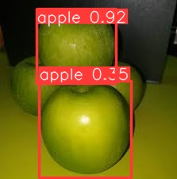

Public

# YoloV8-S

The most recent and cutting-edge `YOLO` model, `YoloV8`, can be utilized for applications including object identification, image categorization, and instance segmentation. `Ultralytics`, who also produced the influential `YOLOv5` model that defined the industry, developed `YOLOv8`. Compared to `YOLOv5`, `YOLOv8` has a number of architectural updates and enhancements.


> **Note**
>
> Install requirements.txt file in a Python>=3.9.0 environment, including PyTorch>=1.7

## Installation

```bash
pip install -r requirements.txt
```

> **Note**
>
> Link to official  [`YoloV8 GitHub page`](https://github.com/ultralytics/ultralytics). 


## Using `yolov8_basics.py`

```python
python yolov8_basics.py
```




## Using `yoloV8_openCV.py`

`Use YoloV8 is an OpenCV way`. Have control over detection on each frame and choose what happens per detection.

```python
python yoloV8_openCV.py
```

## Code | `yoloV8_openCV.py` |


```python
import random
import cv2
import numpy as np
from ultralytics import YOLO

# Load class labels
with open("utils/labels.txt", 'r') as my_file:
    data = my_file.read()
class_list = data.split('\n')

# Generate random colors for the boxes
detection_colors = [(random.randint(0, 255), random.randint(0, 255), random.randint(0, 255)) for _ in range(len(class_list))]

# Load YOLOv8s model
model = YOLO("weights/yolov8s_trained.pt", "v8")

# Vals to resize video frames
frame_wid = 512
frame_hyt = 512

cap = cv2.VideoCapture(1)

if not cap.isOpened():
    print("Can't open the Camera!")
    exit()

while True:
    # Capture frame-by-frame
    ret, frame = cap.read()

    if not ret:
        print("Can't receive frame (stream end?). Exiting ...")
        break

    # Predict on image
    detect_params = model.predict(source=[frame], conf=0.45, save=False)

    # Convert tensor array to numpy
    DP = detect_params[0].numpy()

    if len(DP) != 0:
        for i in range(len(detect_params[0])):
            boxes = detect_params[0].boxes
            box = boxes[i]  # returns one box
            clsID = int(box.cls.numpy()[0])  # Cast to int for indexing

            # Adjust class ID to fit within the range of detection_colors
            clsID_adjusted = clsID % len(detection_colors)

            conf = box.conf.numpy()[0]
            bb = box.xyxy.numpy()[0]

            if clsID_adjusted < len(class_list):
                cv2.rectangle(
                    frame,
                    (int(bb[0]), int(bb[1])),
                    (int(bb[2]), int(bb[3])),
                    detection_colors[clsID_adjusted],
                    3,
                )

                # Display class name and confidence
                font = cv2.FONT_HERSHEY_COMPLEX
                cv2.putText(
                    frame,
                    class_list[clsID_adjusted] + " " + str(round(conf * 100, 2)) + "%",
                    (int(bb[0]), int(bb[1]) - 10),
                    font,
                    1,
                    (255, 255, 255),
                    2,
                )

    # Display the resulting frame
    cv2.imshow("ObjectDetection", frame)

    # Terminate run when "Q" pressed
    if cv2.waitKey(1) == ord("q"):
        break

# When everything done, release the capture
cap.release()
cv2.destroyAllWindows()

```

# Food-Detection-YOLOv8s

